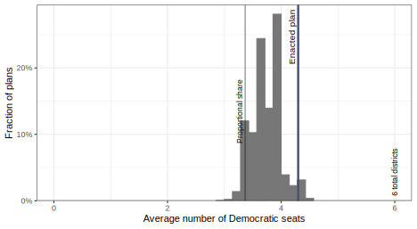
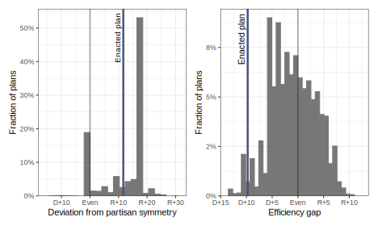
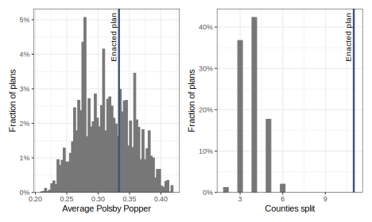

## What is the 50-State Simulation Project about? {#overview}

Every decade following the Census, states and municipalities must redraw districts for Congress, state houses, city councils, and more.
The goal of the 50-State Simulation project is to enable researchers, practitioners, and the general public to use cutting-edge redistricting simulation analysis to evaluate enacted Congressional districts.

Over the past few years, academic researchers, including those on the [ALARM Project](https://alarm-redist.github.io/), have developed redistricting simulation algorithms.
These algorithms can be used to obtain a representative sample of alternative plans one could draw under each state's rules for drawing districts.
The comparison of an enacted plan with these sampled alternative plans can reveal the extent to which the enacted plan is likely to yield extreme partisan, racial, or other outcomes.

Our mission is to bring these modern redistricting simulation algorithms to researchers, policy makers, data journalists, and citizen data scientists.
The ALARM project has developed an open-source software package [redist](​​https://alarm-redist.github.io/about.html) to simulate and analyze alternative plans under any redistricting criteria tailored to the user's analysis goals.
We have also developed a set of new tools that facilitate the efficient workflow including data ingestion, preprocessing, diagnostics, visualizations, and post-simulation analyses.
The 50-State Simulation Project demonstrates how to use all of these tools in a unified workflow in the context of each state, and provides a set of 5,000 alternative plans for each congressional (and later, state legislative) redistricting plan.

Our simulation analyses should serve as a realistic template for those who are interested in conducting their own analyses.
Our code can be modified and extended, and the resulting samples can be used to explore various properties of potential plans under the specific redistricting criteria of our analysis.
Our simulations presented here, however, do *not* represent our evaluation of the *legality* of the enacted and other plans.
Any such evaluation of the enacted plan would require the interpretation of relevant laws.
Although some requirements are relatively straightforward to interpret and operationalize (e.g., minimizing splits of administrative boundaries), others such as compliance with the Voting Rights Act require legal justifications.
For this reason, we do not claim that the analyses presented here are necessarily applicable when evaluating the legality of redistricting plans.

## Why are simulations useful? {#why-sims}

Evaluating a redistricting plan requires analysts to take into account each state's redistricting rules and particular political geography.
Comparing the partisan bias of a plan for Texas with the bias of a plan for New York, for example, is likely misleading.
Comparing a state's current plan to a past plan is also problematic because of demographic and political changes over time.
Simulations generate an ensemble of alternative redistricting plans within a given state which are tailored to its redistricting rules.
Unlike traditional evaluation methods, therefore, simulations are able to directly account for the state's political geography and redistricting criteria.

## Where can I find the code, data, and simulated plans? {#code-data}

For each state, we release 5,000 alternative plans, according to our best approximation of each state's redistricting rules.
The code used to generate the simulated plans is also available so that others can use it as a template to generate their own simulated plans under different specifications.
The major outputs are posted on the [ALARM Project Dataverse](https://dataverse.harvard.edu/dataset.xhtml?persistentId=doi:10.7910/DVN/SLCD3E), and the code is available on [GitHub](https://github.com/alarm-redist/fifty-states/).

| Output File   | What is it?                                                                                                                                                            |
|---------------|------------------------------------------------------------------------------------------------------------------------------------------------------------------------|
| `*_map.rds`   | A `redist_map` R object. A geographic (typically VTD-level) dataset with election data, demographics, a shapefile, and an adjacency graph.                             |
| `*_plans.rds` | A `redist_plans` R object. A district-level dataset containing the 5,000 simulated plans as a matrix of district assignments corresponding to the rows in `*_map.rds`. |
| `*_stats.csv` | A district-level dataset with standard redistricting measures reported for the enacted plan and all 5,000 simulations.                                                 |
| `*_doc.html`  | A documentation file containing data sources, our interpretations of legal requirements, and other simulation decisions.                                               |

| To ...                                                  | Look at ...                                     |
|---------------------------------------------------------|-------------------------------------------------|
| See key metrics for the enacted map and simulated plans | Summary file (e.g. `MA_cd_2020_stats.csv`)      |
| Work with the simulated and enacted plans               | Plans object (e.g. `MA_cd_2020_plans.rds`)      |
| See the constraints used to make the simulations        | Documentation HTML (e.g. `MA_cd_2020_doc.html`) |
| Visualize the Enacted map and precinct-level data       | redist_map R object (e.g. `MA_cd_2020_map.rds`) |
| Create custom metrics to evaluate the enacted map       | redist_map combined with the plan object        |

Those wishing to add additional metrics to these districts may find the documentation for [redist](https://alarm-redist.github.io/redist/reference/index.html) and [redistmetrics](https://alarm-redist.github.io/redistmetrics/reference/index.html) useful.

## How should I interpret the simulation graphs? {#plots}

The graphs we provide with each simulation compare the enacted plan with the range of alternative plans in terms of expected number of seats, election results by districts, partisan bias, and some traditional districting criteria.
We explain how to interpret graphs with examples below.

### Expected number of seats {#plots-exp-seats}

In each state, we average across several statewide elections from 2016-2020, and represent the range of the expected number of districts won by a party with a histogram.
In Oregon, for example, Democrats are expected to win about 3.5 out of the 6 congressional districts under simulated plans.
This is close to proportional representation of their statewide vote of 3.3 Democratic seats.
In contrast, under the enacted plan, the Democratic party is expected to win as many as 4.2 seats.
Less than 1% of simulated plans would yield the same or higher expected number of Democratic seats as the enacted plan.
The histogram ranges from 3.5 to 4.5, which tells us that the Democrats would likely not be able to consistently win 5 seats under Oregon's geography, legal constraints, and recent performance in statewide elections, regardless of the plan.
A takeaway from this histogram is that although the majority party usually wins more seats than proportional representation, the enacted map is a statistical outlier in the degree of that Democratic advantage.

### Election results by districts {#plots-districts}

In addition to the statewide, we can also compare the enacted plan with the simulated plans at the district level.
We first order the districts of the enacted plan by the variable of interest.
For example, to evaluate district level Democratic vote in Oregon with 6 districts, we sort the districts from the least Democratic (ordered district 1) to the most Democratic district (ordered district 6).
We repeat this for each of the simulated plans.
Once the districts are sorted for both the enacted and simulated plans, we use a dot to represent the Democratic vote percent for each ordered district of a simulated plan.
For the enacted plan, we use a black horizontal line.
This allows visual comparison between the enacted and simulated plans.
In the example below, the enacted plan appears to pack Republicans in the most Republican district (1), while making the second most Republican district (2) barely Democratic.
Again, the number on the x-axis does not correspond to the actual district number under the enacted plan.
Instead, it represents the order of districts sorted by the variable of interest for each plan.
The variable of interest is then made into the y-axis.

### Partisan bias metrics {#plots-pbias-egap}

We measure the partisan bias of a plan in two ways: the efficiency gap and the deviation from partisan symmetry.
The efficiency gap of a plan is the difference in the two party's wasted votes as a fraction of the statewide turnout.
It is a measure of packing and cracking.
If a Democrat won a district with 60% of the vote, then each vote above 50% + 1 of the total votes are wasted because the district could have won by 50% + 1 votes.
Similarly, if a Democrat loses a district with 45%, then each of those votes are wasted because those votes did not lead to a seat.
The efficiency gap for Democrats shown in the histogram is the Democratic wasted votes minus the Republican wasted votes.
Thus, positive values indicate a pro-Republican bias whereas a negative value indicates a pro-Democratic bias.
In the Oregon plan, the gap is -0.10, meaning that Democratic votes are wasted at a much smaller rate than Republican votes.

Another measure we use is deviation from partisan symmetry in the seats-votes curve.
Suppose a plan leads to 60% Democratic seats when their statewide vote share is 55%.
If the map satisfies partisan symmetry, the Republican seat share should also be 60% if they win 55% of the votes in another election.
We represent the *deviation* from partisan symmetry by computing the excess Republican seat share above 50% when their vote share is 50%.
This measure is typically called the "partisan bias" of a plan in the academic literature on redistricting.
In the Oregon example below, the 0.1 deviation from partisan symmetry means that in a 50-50 election, the plan allocates 60% of seats to the Republicans, rather than the symmetric outcome of 50% of seats.
While the enacted plan is more favorable towards the Republican party than a plan that exhibits partisan symmetry (a value of 0), it still favors the Democratic plan more than the modal simulated plan (around 0.18 on the histogram).

### Traditional Redistricting Criteria {#plots-trad}

The histograms for compactness and counties split compare the enacted and expected maps in the same way as partisan metrics.
We measure geographic compactness with the Polsby-Popper compactness score of each district, and take its average across districts.
Polsby Popper scores range from 0 to 1 with 1 indicating a circle.
The "counties split" measure is the number of counties which are not wholly contained within a single district.
In the Oregon example, the enacted plan is near the central tendency of the alternatives in terms of compactness.
However, it splits 11 counties whereas the alternative plans only split up to 6 counties.

## What are the redistricting rules used to generate simulated plans?

We have documented the rules we used to simulate our alternative plans.
All simulated plans will be contiguous, respect population equality, and are at least somewhat compact.
Many states have their own specific rules, which we attempt to follow.
The set of constraints used depends on the state's redistricting rules.

-   Hard **county splitting** constraint: Unless otherwise noted, a simulated plan will split fewer counties than the number of districts.
-   Hard **population** constraint: Congressional districts must be roughly equal in population, so all state simulations contain a user-specified cap on the maximum deviation of any one district from the target population, which is the total statewide population divided by the number of districts. This deviation is 0.5% of the target population or less, except when a state explicitly specifies a maximum.
-   **Compactness** constraint: Unless otherwise noted, the algorithm nudges towards compact districts by an adjacency-graph-based measure of compactness, the fraction of edges kept.
-   **Municipality** splitting constraint: In some states, the simulations avoid splitting municipalities within large counties many times to preserve political subdivisions.
-   **VRA constraint**: In some states, the simulations are encouraged to accept plans that have a concentrated minority share of the voting age population or citizen voting age population, in accordance with the Voting Rights Act of 1965.

## Disclaimers

-   For consistency, reference plans, such as the 2010 or 2020 enacted plans, are best matched to the VTD or tract level.
    Reference plans often split a few of these at the block level.
    This may have a very small impact on estimated metrics.

-   VRA compliance requires substantial information, including a racially polarized voting analysis and knowledge of local history.
    For the purposes of this project, we target the number of minority-opportunity districts as in the enacted plan.
    We check approximate performance of these districts.
    Simulation results can change if different VRA constraints are imposed.

-   Constraints are based on our interpretation of the law, but we are not lawyers.
    We do our best to follow the requirements and choices made by states.

-   Any suggestions for improving the analysis, including legal interpretation of statutory requirements are welcome and should be submitted [as a GitHub issue](https://github.com/alarm-redist/fifty-states/issues/new).

## Data Sources and Availability {.appendix}

Unless otherwise noted, data for each state comes from the ALARM Project's [2020 Redistricting Data Files](https://alarm-redist.github.io/posts/2021-08-10-census-2020/), which use U.S.
Census demographic data (in the public domain) and election data from the [Voting and Election Science Team](https://dataverse.harvard.edu/dataverse/electionscience), which is licensed under a [CC BY 4.0](https://creativecommons.org/licenses/by/4.0/) license.
In these cases, shapefiles are also taken from the U.S.
Census Bureau.
The U.S. map here, scaled to reflect Congressional representations, is courtesy of <https://dkel.ec/map>.

All data is available on [our Dataverse](https://doi.org/10.7910/DVN/SLCD3E) and has been released to the public domain.
Code is available on [GitHub](https://github.com/alarm-redist/fifty-states/) under an MIT license.

