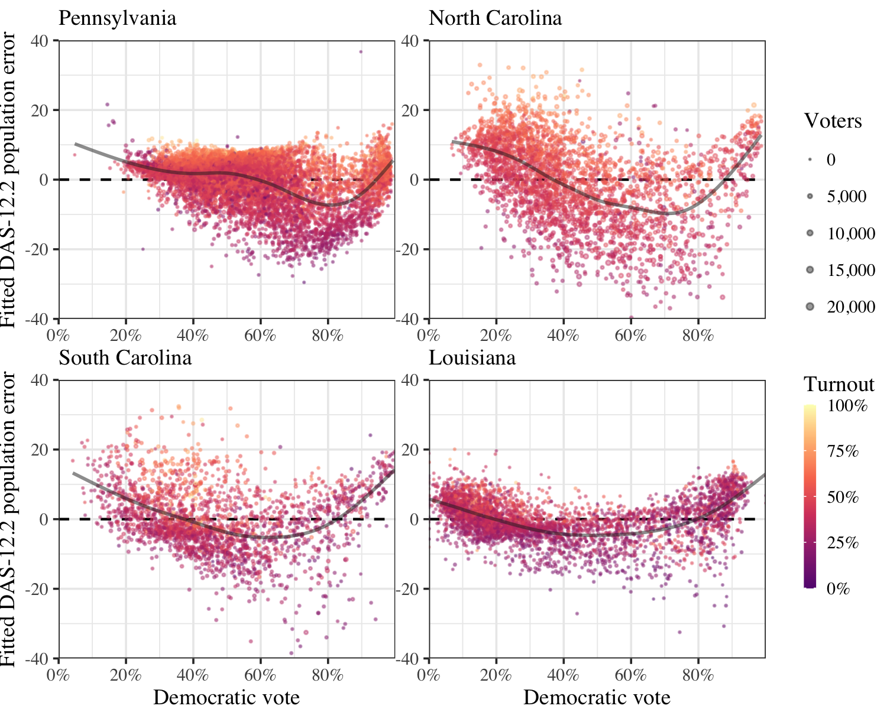

The U.S. Census Bureau plans to protect the privacy of 2020 Census respondents
through its Disclosure Avoidance System (DAS), which attempts to achieve
differential privacy guarantees by adding noise to the Census data.
The Bureau has asked for feedback on the adequacy of DAS-protected data
for real-world purposes.  The ALARM project has conducted an extensive analysis
into how the DAS-protected data affects redistricting and voting rights analyses,
and has submitted these findings to the Census Bureau.

**Read the report: *[The Impact of the U.S. Census Disclosure Avoidance System on Redistricting and Voting Rights Analysis"](Harvard-DAS-Evaluation.pdf)***

{width=100% .external}

By applying redistricting simulation and analysis methods to DAS-protected 2010
Census data, we find that the protected data are not of sufficient quality
for redistricting purposes. Compared to the original Census 2010 data, we find
that the DAS-protected data:

-   **Prevent map drawers from creating districts that satisfy the *One Person, 
    One Vote* principle, according to current statutory and judicial
    standards.** Actual deviations from equal population will generally be
    several times larger than as reported under the DAS data. The magnitude of
    this problem increases for smaller districts such as state legislative
    districts and school boards.

-   **Transfer population from low-turnout, mixed-party areas to high-turnout,
    single-party areas.** This differential bias leads to different district
    boundaries, which in turn implies significant and unpredictable differences
    in election results. The discrepancy also degrades the ability of analysts
    to reliably identify partisan gerrymanders.

-   **Transfer population from racially mixed areas to racially segregated
    areas.** This bias effectively means racially heterogeneous areas are
    under-counted. The degree of racial segregation can therefore be
    over-estimated, which can lead to a change in the number of
    majority-minority districts. It also creates significant precinct-level
    variability, which adds substantial unpredictability to whether or not a
    minority voter is included in a majority-minority district.

-   **Alter individual-level race predictions constructed from voter names and
    addresses.** This leads to fewer estimated minority voters and majority-minority
    districts in a re-analysis of a recent Voting Rights Act case, *NAACP v.
    East Ramapo School District.* At a statewide level, however, the DAS data
    does not curb the ability of algorithms to identify the race of voters from
    names and addresses. Therefore, this casts doubt on the universal privacy
    protection guarantee of DAS data.
    
Our primary recommendation is to release Census P.L. 94-171 data without using
the Disclosure Avoidance System, and instead rely on a swapping method similar
to that applied to the 2010 Census data in order to protect respondent privacy.

If the Census Bureau decides to apply the current DAS to Census PL. 94-171 Data,
we recommend increasing the privacy loss budget and allocating the increase to
improving redistricting outcomes.  In particular, preserving the accuracy of
populations at the voting tabulation district level would be critical.  The
Bureau must avoid injecting noise that systematically undercounts certain racial
and partisan groups in the privacy-protected data. Additional recommendations
are given in the paper.

