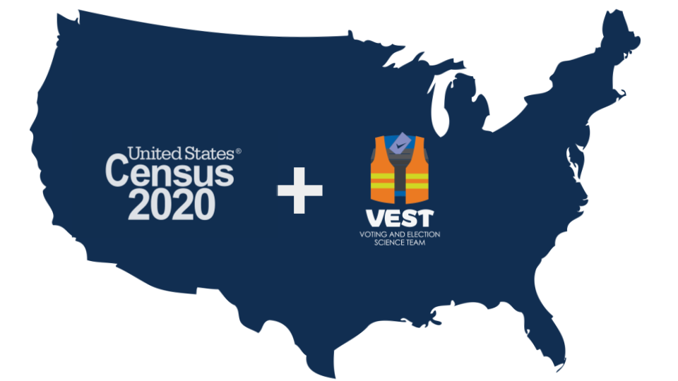

```{r echo=FALSE}
library(htmltools)
HTML(readLines("state-svg-defs.svg"))
```




The ALARM Project is glad to provide precinct-level demographic and election data
from the [2020 decennial census](https://www.census.gov/2020census) and the
[Voting and Election Science Team](https://dataverse.harvard.edu/dataverse/electionscience)
which have been tidied and joined together using 2020 precinct boundaries.
Where 2020 precinct boundaries are not available, Census block-level data is
provided instead, and where no VEST data is available, only demographic
information is provided. Code to generate the data from these sources is
included; the entire workflow is open-source and reproducible.

## Getting the data

Download individual states' data below, or
[download a ZIP of all the data here](https://github.com/alarm-redist/census-2020/archive/refs/heads/main.zip).
Our [repository](https://github.com/alarm-redist/census-2020) also contains 
more detailed data, as well as code and instructions for programmatic
downloading, adding shapefile geometries, and other use cases.

Please make sure to cite the
[Voting and Election Science Team](https://dataverse.harvard.edu/dataverse/electionscience)
and the [U.S. Census Bureau](https://www.census.gov/2020census).
Consult [the license](https://github.com/alarm-redist/census-2020/blob/main/LICENSE.md)
for information on modifying and sharing the data and/or code.

### 2020 state data

```{r echo=FALSE}
library(tidyverse)

raw = gh::gh("GET /repos/alarm-redist/census-2020/contents/census-vest-2020/")
files = keep(raw, ~ str_ends(.$name, "\\.csv")) %>% 
    map_dfr(~ tibble(abb = str_to_upper(str_sub(.$name, 1, 2)),
                     type = if_else(str_detect(.$name, "_block"), "Census blocks", "VTDs"),
                     filename = .$name, 
                     url = .$download_url))

if (nrow(files) == 0) {
    em("Available by August 13, 2021")
} else {
    files = files %>%
        left_join(select(censable::stata, abb, state=name), by="abb") %>%
        arrange(state)
    pmap(files, function(state, abb, type, filename, url, ...) {
        a(href=url, target="_blank", download=filename,
            div(tags$svg(class=paste0("icon icon-state-", abb), 
                         style="height: 1.8em; width: 2.0em; position: relative; top: 0.7em;",
                         tags$use(`xlink:href`=paste0("#icon-state-", abb))),
                HTML("&nbsp;"),
                strong(state, " ", type),
                HTML("&nbsp;"),
                icons::feather_icons("download"), 
                HTML("&nbsp;"),
                code(filename, style="color: #777777;")))
    }) %>%
        as.tags()
}
```

<br>

## Using the data
  
### Data Format
Each data table contains several identification columns, a set of census-derived
demographic columns, and a set of VEST-derived election columns.

- `GEOID20` is the unique identifier for a precinct or Census block. 
  The `state` and `county` of the precinct or block are also provided.
- Census variables are prefixed with `pop_` or `vap_`, depending on whether
  they are for the entire population or the voting-age population.
  Suffixes refer to racial and ethnic categories, as follows:
  
    * `_hisp`: Hispanic or Latino (of any race)
    * `_white`: White alone, not Hispanic or Latino
    * `_black`: Black or African American alone, not Hispanic or Latino
    * `_aian`: American Indian and Alaska Native alone, not Hispanic or Latino
    * `_asian`: Asian alone, not Hispanic or Latino
    * `_nhpi`: Native Hawaiian and Other Pacific Islander alone, not Hispanic or Latino
    * `_other`: Some Other Race alone, not Hispanic or Latino
    * `_two`: Population of two or more races, not Hispanic or Latino
    
- Election variables consist of average vote counts for Democratic and
  Republican candidates. The `adv_##` and `arv_##` columns report the
  average vote count in the `##` election, across all statewide races
  contested by both parties. The `ndv` and `nrv` columns further average
  the vote counts across all available election years.  For specific statewide
  races, you may download the files in `vest-2020/` and join them to the data
  using the `GEOID20` column.

### More Tools

- For redistricting and voting rights analysis, we recommend the
  [`redist`](https://alarm-redist.github.io/redist/) package.
- For pre-processing and tidying data for redistricting analysis, we recommend the
  [`geomander`](https://christopherkenny.github.io/geomander/) package.
- For more custom tabulations of the 2020 census data, we recommend the
  [`PL94171`](https://corymccartan.github.io/PL94171/) package.
- For general-purpose census data processing, we recommend the 
  [`censable`](https://christopherkenny.github.io/censable/) package.
- For alternate data unaffected by Census differential privacy, you may want to
  consider FCC block-level estimates, available using the
  [`blockpop`](https://corymccartan.github.io/blockpop/) package.
  
## Technical notes
To produce election data using 2020 precinct boundaries, election results were
projected down to the 2010 block level using voting-age population as weights.
Results for 2020 blocks were then estimated using 2010 blocks and the
[land-use-based crosswalk files](https://dataverse.harvard.edu/dataset.xhtml?persistentId=doi:10.7910/DVN/T9VMJO)
from VEST. Finally, 2020 blocks were aggregated to 2020 precincts using the 
Census' 2020 [block assignment files](https://www.census.gov/geographies/reference-files/time-series/geo/block-assignment-files.html).
