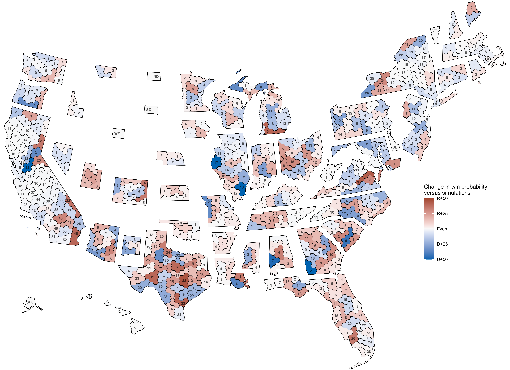

```{r, fig.height=8, fig.align='center'}

```

We are delighted to announce that "Widespread Partisan Gerrymandering Mostly Cancels Nationally, but Reduces Electoral Competition" has been accepted for publication in *PNAS*, the *Proceedings of the National Academy of Sciences of the United States of America*. This article evaluates the partisan effects of redistricting in 2020 using simulations, allowing us to account for both compliance with legal requirements and the effects of political geography. While many individual state plans are biased in favor of one party or the other, the US House plan for 2022 is relatively unbiased. However, many districts are quite a bit less competitive than would be typically expected. 

A pre-print of the article is available [on arXiv](https://arxiv.org/abs/2208.06968).

We are grateful to the editors and reviewers for their helpful feedback in improving this paper.
