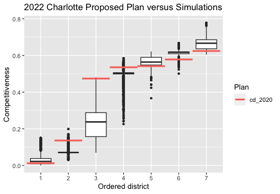
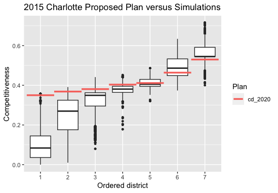
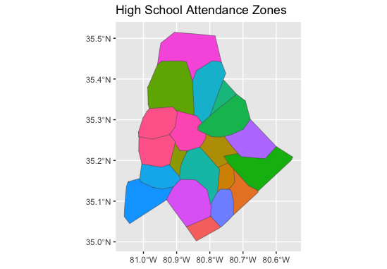
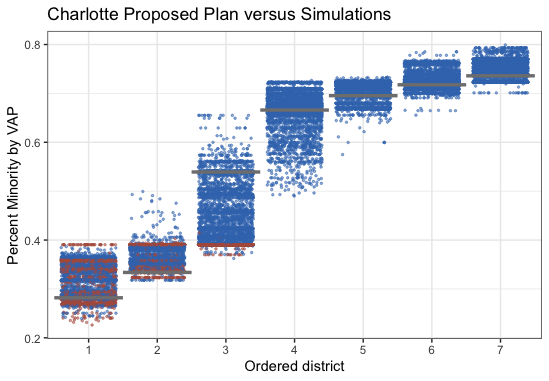

```{r setup, include=FALSE}
knitr::opts_chunk$set(echo = FALSE)
```

## City Council in Charlotte

The Charlotte City Council is made of the Mayor, four at-large city council members, and one council member for each of the seven city council districts. Currently, two members of the city council are Republicans and the remaining are Democrats.

For the demographic breakdown, Charlotte is roughly 40% White, 33% Black, 16% Hispanic, and 7% Asian. For the partisan breakdown, Charlotte voted 68% Democrat and 32% Republican in the the latest 2021 Mayoral Election.

## Decreased Competition in Charlotte Elections

Charlotte, NC is a fascinating city where voting patterns have undergone significant changes in the last few years alone. For example, in the 2015 Mayoral election, the partisan breakdown was 52% Democrat and 48% Republican, which is much more competitive than the most recent election, which voted 68% Democrat and 32% Republican. The significant increase in Democrat voters and decrease in competitiveness raises the question of whether the recently enacted city council districts influenced the competitiveness in Charlotte or if the city has simply become more left-leaning over time.

## Analyzing Competitiveness In 2015 and 2022 Elections On Simulated District Maps

I used election data from the 2022 Charlotte Mayoral and city council at-large elections and the 2015 Mayoral election to generate two sets of simulated redistricting plans using the Sequential Monte Carlo (SMC) algorithm. For each simulated plan, a measure of competitiveness in each district was calculated by the absolute value of the difference in Democrat and Republican votes divided by the total number of votes. This measure of competitiveness allowed me to compare only whether districts were more competitive without focusing on which party it favored. In this case, the measure of competitiveness is always between zero and one, where lower values indicate greater competition.

I calculated the competitiveness by district for simulated plans based on 2022 Mayoral election and city council at-large election data to see if the enacted plan was more or less competitive than the simulations. I also plotted the competitiveness by district based on the 2015 Mayoral election results, still with the currently enacted plan, to see if there are significant differences in competitiveness when these two sets of election results are simulated according to the same map.

{width="319"}

{width="320"}

*Figure 1: The box plot to the left shows the competitiveness by district based on the 2022 Charlotte Mayoral election data, simulated with the 2022 city council district map. The red bars indicate the currently enacted plan.*

*Figure 2: The box plot to the right shows the competitiveness by district based on the 2015 Charlotte Mayoral election data, simulated with the 2022 city council district map to provide a clearer comparison on the competitiveness difference of two different sets of election data when on the same district map. The red bars indicate the currently enacted plan.*

The plots above show the competitiveness by district based on the 2015 and 2022 election data. Comparing the enacted plan based on 2015 and 2022 election data, five of the seven districts are less competitive in 2022, which accurately reflects the significant decrease in competition from 2015 to 2022. In the 2022 plot, the enacted plan is more competitive than the simulated plans in four of the seven city council districts and less competitive in the other three. In the 2015 plot, the enacted plan is more competitive than the simulated plans in two of the seven city council districts, and less competitive in the other five.

This follows the results from the actual 2015 and 2022 elections in that the 2022 election was much less competitive with a far greater vote difference between Democrats and Republicans. Simulating the 2015 election data on the currently enacted map still produced results that were much more competitive in 2015 compared to 2022. Furthermore, the current level of competition in Charlotte elections seems to be accurate to the actual partisan breakdown, as the simulated plans for the 2022 elections were roughly balanced with the currently enacted plan, with four more competitive districts and three less competitive districts. As a result, these plots show that the decrease in competitiveness in Charlotte from 2015 to 2022 is likely due to demographic and political shifts in those years rather than the enacted plan reducing competitiveness.

## Methods and Materials

#### Data

Election data came from the 2015 Mayoral election and the 2022 Mayoral and city council at-large elections. The North Carolina State Board of Elections organizes the election data by precinct, after which I kept only the candidates who were Democrats or Republicans in order to more clearly analyze the partisan competitiveness. One precinct with no voting data was removed, as well.

The Charlotte council district and precinct maps came from the City of Charlotte Open Data Portal. The precinct map of Charlotte was merged with the precinct election data, which was then filtered down to the council district boundaries.

Sources are linked below.

-   [Election Data](https://er.ncsbe.gov/index.html?election_dt=07/26/2022&county_id=60&office=ALL&contest=0)
-   [City of Charlotte GIS Map -- Council Districts](https://data.charlottenc.gov/datasets/charlotte::council-districts/explore?location=35.216425%2C-80.785856%2C10.00&style=District)
-   [City of Charlotte GIS Map -- Precincts](https://www.nconemap.gov/datasets/voting-precincts/explore?filters=eyJjb3VudHlfaWQiOls2MCw2MF19&location=35.248115%2C-80.674966%2C10.43)

### Methods

I sampled 30,000 redistricting plans for North Carolina, across two independent runs of the SMC algorithm, then thinned the sample down to 5,000 plans.

For constraints, I used the high school attendance zones in Charlotte as the neighborhood map. We use neighborhood maps when producing redistricting simulations as many cities attempt to preserve communities of interest when drawing new district maps, in order to avoid splitting a single neighborhood into multiple city council districts. Other potential neighborhood zones, like the Neighborhood Statistical Areas, historical districts, and Zip Codes were tested, but did not provide any benefit as a constraint because the neighborhood areas were too small or lacked coverage over the entire city. The neighborhood plot of school zones is shown below.



When running simulations, we must also compliance to the Voting Rights Act (VRA). VRA compliance attempts to prevent gerrymandering that disadvantages minority populations by requiring a certain number of minority-majority districts in which minorities account for over 50% of the voting-age population. These districts are often created with a hinge constraint. These constraints work by creating a list of target percentages for each district and penalizing simulated maps based on adherence to those target percentages. Hinge constraints can then encourage the creation of more majority-minority districts for the purpose of VRA compliance. However, VRA compliance through the creation of these majority-minority districts is only required if voting patterns are racially polarized. However, given that Charlotte is a very democratic city on the whole, there is not a clear racial voting pattern that would indicate the need for the creation of more majority-minority districts. Most people vote Democrat no matter their race. As a result, we did not need a hinge constrait for VRA compliance. The minority VAP performance plot is shown below, which indicates the percentage of the minority VAP population by district, with red and blue indicating Republican and Democrat, respectively.



Here are the other validation plots from running on the Charlotte 2022 election data. These validation plots are used to ensure that the simulations produced satisfy the conditions required for a redistricting map. The plan diversity map indicates that most plans are unique from one another, reducing the number of repeats throughout the simulations. The population deviation graph indicates the percent difference in population compared to a completely equal split of the population in each district. On this count, we do significantly better than the enacted plan. Compactness is important to redistricting maps, as districts that are not compact can signal gerrymandering. This is measured in two different ways, and both methods of calculating compactness show that the simulated plans tended to be more compact than the enacted plan. In terms of neighborhood splits, our simulations in fact perform significantly better. Similarly, the simulated plans do significantly better at reducing neighborhood splits compared to the enacted plan. Furthermore, the simulated plans show a similar number of majority-minority VAP districts. As a result, the Charlotte redistricting simulations perform very well in each of these important factors.


Distill is a publication format for scientific and technical writing, native to the web.

Learn more about using Distill at <https://rstudio.github.io/distill>.
