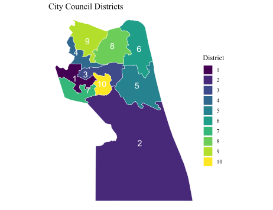

## The Virginia Beach City Council

Virginia Beach became an incorporated town in 1906 from Princess Anne County, and became an independent city in 1952. A legal battle with the City of Norfolk prompted a consolidation of the City of Virginia Beach with Princess Anne County again in 1962, forming the independent city of Virginia Beach.

Virginia Beach is heavily influenced by the presence of the military. Apart from the Pentagon in Arlington, Virginia, Virginia Beach has the largest concentration of military personnel with [9 military installations](https://www.yesvirginiabeach.com/business-environment/military) from every branch of the US armed forces; this includes the largest naval base in the world. Thus, it has been classified by the [American Communities Project](https://www.americancommunities.org/) as a military post: "middle-income, diverse communities, around military bases."

There are 11 members in the Virginia Beach City Council. Ten members of the city council are elected in one of ten districts as shown in Figure 1. Displayed in Figure 2, three districts are currently Majority Minority Districts (MMDs), where the majority voting-eligible people in the district belong to a cohesive minority group.

::: {style="display: flex;"}
::: {style="flex-direction: column; margin-right: 5px;"}
{width="328"}
:::

::: {style="flex-direction: column; margin-right: 5px;"}
{width="328"}
:::

::: {style="flex-direction: column;"}
{width="328"}
:::
:::

The eleventh member is elected at-large to serve as the mayor of the city. While the council is legally nonpartisan, candidates with political affiliations emerged just seven years after the formation of the city council in 1963. Historical elections have been competitive between both Democrats and Republicans with a few declared independents, but the overall majority of the city council historically leaned Republican, especially prior to the 2022 court-ordered redistricting. The current 2023 City Council is comprised of six Democrats and five Republicans (Figure 3), with Republican Bobby Dyer serving as mayor. No candidates were up for reelection in the November 7, 2023 Virginia general election.

| [Mayor]{.smallcaps} | [1]{.smallcaps}   | [2]{.smallcaps}       | [3]{.smallcaps}       | [*4*]{.smallcaps}         | [5]{.smallcaps}     | [6]{.smallcaps}  | [*7*]{.smallcaps}    | [8]{.smallcaps}  | 9                  | *10*                 |
|-------|-------|-------|-------|-------|-------|-------|-------|-------|-------|-------|
| Bobby Dyer (R)      | Rocky Holcomb (R) | Barbara M. Henley (D) | Michael Berlucchi (R) | *Amelia Ross-Hammond (D)* | Rosemary Wilson (R) | Worth Remick (D) | *Sabrina Wooten (D)* | Chris Taylor (R) | Joash Schulman (D) | *Jennifer Rouse (D)* |

: Table 1: Current Virginia Beach City Council makeup. Majority-Minority Districts are italicized.

The ten districts are constructed from 108 voting precincts displayed in Figure 4 below. Census blocks, which are areas bounded by visible features such as roads or streams and invisible features such as property lines or other city/school districts, are visualized in Figure 5. These blocks help visualize where the city is located, as census blocks often follow city blocks in urban environments.

::: {style="display: flex;"}
::: {style="flex-direction: column; margin-right: 1px;"}
{width="328"}
:::

::: {style="flex-direction: column;"}
{width="338"}
:::
:::

### Demographics & Partisan Breakdown

Virginia Beach City has a population of 457,672 recorded in the 2020 US census, making it the largest independent city in Virginia and the 42nd largest in the United States. It is ranked by the Census Bureau as the 36th largest urban area; its metropolitan statistical area (MSA), the Hampton Roads MSA, is the 37th largest metropolitan area in the US. The overall demographic breakdown of the city is in the table below; population data is sourced from the 2020 Census and VAP/CVAP data is sourced from a count by the Virginia Department of Elections in the 2019 Virginia elections.

| Demographic              | Population | Voting Age Pop. | Citizen Voting Age Pop. |
|-------------------|------------------|------------------|------------------|
| White, non-Hispanic      | 58.7%      | 61.5%           | 65.8%                   |
| Black, non-Hispanic      | 20.1%      | 20.1%           | 19.7%                   |
| Asian, non-Hispanic      | 10%        | 9.4%            | 6.8%                    |
| Hispanic                 | 8.8%       | 7.6%            | 6.4%                    |
| Black + Hispanic + Asian | 40.5%      | 37.2%           | 32.8%                   |

: Table 2: Demographic Breakdown of Virginia Beach, VA. in 2020

Figure 6 shows the population density of the overall city to a precinct level. This is important for drawing city council boundaries, as per the Virginia Voting Rights Act, a district can only deviate from the average population in every district by 5%. However, how do we know who is actually eligible to vote? Figure 7 shows the percentage of the population in any given precinct that is of voting age, which is more indicative of current voter demographics.

::: {style="display: flex;"}
::: {style="flex-direction: column; margin-right: 10px;"}

:::

::: {style="flex-direction: column;"}

:::
:::

Figures 8 and 9 show the percentage of minority and black populations by precinct. Districts 4, 7, and 10 are majority-minority districts (MMDs), shown in Figure 2.

::: {style="display: flex;"}
::: {style="flex-direction: column; margin-right: 20px;"}
{width="328"}
:::

::: {style="flex-direction: column;"}
{width="328"}
:::
:::

In Virginia Beach City, minority populations tend to vote as a block for Democratic candidates. Figure 10 displays the vote percentage of Democrats and Republicans in each precinct; Democrats perform best in black/minority precincts. To quantify how cohesive a group of voters are, Figure 11 examines only precincts where the majority of residents in the precinct is a minority. The percentage of democratic votes in any given precinct trends similarly to the overall percentage of minority residents in the precinct, ranging from a .78 to 1.05 ratio.

::: {style="display: flex;"}
::: {style="flex-direction: column; margin-right: 20px;"}
{width="328"}
:::

::: {style="flex-direction: column;"}
{width="328"}
:::
:::

## Redistricting in Virginia Beach

### Holloway v. City of Virginia Beach, Va.

In 2017, Virginia Beach residents Latasha Holloway and Georgia Allen sued the City of Virginia Beach claiming that Virginia Beach's current at-large method to elect council members violated Section 2 of the Voting Rights Act by diluting the strength of minority votes in the legal case [Holloway v. City of Virginia Beach, Va.](https://thearp.org/litigation/holloway-v-city-virginia-beach-va/) Since 1998, Virginia Beach City Council members were elected in seven districts including three at-large council members; although candidates for one of the seven district seats had to reside in the district they were running for, all voting was conducted at-large. Residents of any district could vote in all seven district elections and the three at-large candidates.

In 2021, Virginia passed [HB 2198](https://lis.virginia.gov/cgi-bin/legp604.exe?ses=212&typ=bil&val=HB2198), which prohibits local governments from using at-large voting for district elections. This led to the 2021 ruling in which the district court ruled that the at-large election method did violate Section 2 of the Voting Rights Act by denying large minority groups in Virginia Beach (African-Americans, Hispanics, and Asians) equal access to political participation, and that those groups were politically cohesive. Although the City of Virginia Beach appealed the decision, the court proceeded by appointing a special master to create a remedial redistricting plan, established in [this memo](https://www.wavy.com/wp-content/uploads/sites/3/2021/12/e18b14d0-d4e8-4b5c-9805-ccc031edf776.pdf). This plan was adopted in 2022 before the November election after another round of appeals in the Fourth Circuit. The Virginia Beach School Board, which historically followed the same election system as the city council, [voted in 2022](https://www.wavy.com/news/local-news/virginia-beach/vb-school-board-votes-to-mirror-new-city-council-election-system-possibly-pitting-incumbents-against-each-other/) to adopt the same election system as the city council.

In 2022, the Fourth Circuit Appeals Court ruled in a 2-1 decision that the case should not have been considered by the district court, holding that HB 2198 already made the electoral system challenged by the plaintiffs illegal. This meant that the at-large electoral system no longer governed Virginia Beach City already and rendered the court case moot. The timing of the ruling meant that the redrawn maps and electoral system would be used in 2022, and could be modified if it met the requirements of the Virginia Voting Rights Act and HB 2198, both of which prevent at-large voting systems if they prevent minority groups from electing preferred candidates.

The makeup of the city council drastically shifted in the 2022 general election, the first local election under the 10-1 system. The council is the [most diverse](https://www.pilotonline.com/2023/01/04/virginia-beach-city-council-now-the-most-diverse-in-city-history-welcomes-new-members/) and youngest in city history, with four Black representatives and four members under 45. [In all of the city council's history](https://wydaily.com/news/local/2019/01/04/new-city-council-could-be-the-most-diverse-in-virginia-beach-history/) since 1966, only four prior city council members were Black, and at most had two seats on the city council at any point in time. Democrats gained two seats on the city council, shifting the makeup from 6 GOP and 4 DEM with a GOP mayor in 2022 to 6 DEM and 4 GOP in 2023.

After a [round of public hearings](https://www.13newsnow.com/article/news/local/vote/virginia-beach-last-public-hearing-on-switch-10-1-voting-system-ahead-of-city-council-vote/291-e23afe35-c0f9-4555-812b-8980bf89dfa0) over the new election system and a survey that showed [81% of residents supported the new system](https://www.pilotonline.com/2023/07/02/virginia-beach-residents-want-to-keep-district-election-system-according-to-study/), the city council voted to [adopt the 10-1 election system](https://campaignlegal.org/update/victory-virginia-beach-adopts-fair-districts-after-clc-successfully-sued-city) with the court-sanctioned district map on August 15th, 2023. Per Virginia state law, any new electoral system, such as 7 districts and 4 at-large, would require approval from the Virginia General Assembly to revise the charter, which at earliest could happen when the General Assembly reconvenes in January 2024.

## Methods and Materials

### Data

We gathered election data from the 2022 U.S. House election that took place in Virginia Beach City. Although the house district encompasses other parts of the Hampton Roads metropolitan area, the Virginia election results website includes breakdowns for all the precincts in Virginia Beach City. The U.S. House was selected, as only the 1st, 2nd, 4th, 6th, 8th, 9th, and 10th city council districts elected a member under the new system in 2022. This makes a full analysis of the city council election unfeasible, as prior elections for city council still operated under the at-large voting system.

Because the Virginia Department of Elections differentiates between early vote (by mail and in-person) and election day vote results for each precinct, data was sourced from two places in the Virginia election results website:

-   [2022 November General Election Virginia Beach City House of Representatives Votes by Precinct](https://results.elections.virginia.gov/vaelections/2022%20November%20General/Site/Locality/VIRGINIA_BEACH_CITY/Member_House_of_Representatives_(02).html)

-   [2022 November General Election Virginia Beach City House of Representatives Absentee Voting by Precinct](https://results.elections.virginia.gov/vaelections/2022%20November%20General/Site/Absentee/VIRGINIA_BEACH_CITY/Index.html)

We compile the specific data (Election Day, Early Voting, Mailed Absentee, Provisional, and Post-Election) to create overall vote splits by precinct. 249 write-in ballots, which constituted 0.15% of the total vote in Virginia Beach, are discarded.

### Runs and Simulations

We sample 20,000 districting plans for Virginia Beach City across fifteen independent runs of the [Sequential Monte Carlo algorithm](https://alarm-redist.org/redist/reference/redist_smc.html) according to [the relevant criteria](#redistricting-requirements). A [summary of simulations](#summary-of-simulations) can be found below.

### Redistricting Requirements

Per [Virginia and Federal law](redistrictingguidelines.pdf) under [Va. Code Ann. § 24.2-304.04](https://casetext.com/statute/code-of-virginia/title-242-elections/chapter-3-election-districts-precincts-and-polling-places/article-2-congressional-senatorial-and-house-of-delegates-districts/section-242-30404-standards-and-criteria-for-congressional-and-state-legislative-districts) redistricting in Virginia Beach must:

1.  have equal populations

2.  provide opportunities for racial/ethnic representation

3.  preserve communities of interest (Va. Code Ann. § 24.2-304.04(5).)

4.  be contiguous (Va. Code Ann. § 24.2-304.04(6).)

5.  be compact (Va. Code Ann. § 24.2-304.04(7).)

In the [2021 Virginia Redistricting](redistrictingguidelines.pdf), the following requirements were considered in order of priority:

1.  be contiguous, compact, and equal in population

2.  preserve existing political subdivisions

3.  create clearly discernible boundaries

4.  be reasonably compact

5.  maintain neighborhoods who share similar social, cultural, and economic interests

### Constraints

Three [constraints](https://alarm-redist.org/redist/reference/constraints.html) are added to simulations to promote districts that will either have a cohesive black voting age population above 55% *or* a small black voting age population. This keeps historically black communities together by discouraging districts that have a percentage of black voting-age population between 20-40%.

1.  A constraint is created that strongly promotes a plan where one district has a black voting age population of at least 55%.

2.  A constraint is created that discourages where the proportion of the black voting age population is less than 40%.

3.  A constraint is created that encourages districts where the black voting age population is less than 20%. 

### Neighborhoods

We utilize elementary school attendance zones to preserve similar communities of interest. School zoning is effective as neighborhoods are often shaped by the school district; school districts often create cohesion in other neighborhood-adjacent indicators such as community and economics, as it affects home prices and who chooses to reside in any given neighborhood. We utilize the [55 elementary school attendance zones](https://data.virginiabeach.gov/datasets/e185bc16ab9a4bbbaf2c2cfcf9156e78_25/about) to serve as a de-facto neighborhood map. School attendance zones usually correlate with historic areas of a city/county, and elementary school attendance zones are small enough to be beneficial for redistricting simulations while encompassing 2-3 neighborhoods.

<center>{width=50%}</center>

These zones are necessary as neighborhoods are important for redistricting simulations; neighborhoods help make contiguous districts that account for community boundaries to avoid splitting a community between different districts. However, neighborhoods are difficult to find in Virginia Beach City, partially because the city fully incorporates Princess Anne County. Unlike other cities such as Phoenix, AZ, the city does not maintain any officially designated neighborhood or borough subdivision of the city. Various real estate agents maintain neighborhood designations, but they all have certain downsides:

-   [Ziemer Real Estate](https://www.ziemerrealestate.com/virginia-beach-family-neighborhoods/)'s neighborhoods are too large for use in preserving boundaries and have spots without neighborhoods

-   [Layton Realty Group](https://www.williamlayton.com/best-neighborhoods-in-virginia-beach/)'s neighborhoods are small and based on historic boundaries, but only cover the original area of Virginia Beach City

-   [City-Data](https://www.city-data.com/nbmaps/neigh-Virginia-Beach-Virginia.html) only has four tiny recorded neighborhoods for Virginia Beach City

We explore various other alternatives:

-   [Zip codes](https://www.unitedstateszipcodes.org/) were considered, but as there are only 20 zip codes in Virginia Beach City with odd shapes, using zip codes worsened the diversity (number of different simulated plans) in simulation outcomes

-   [Census block maps](https://www.census.gov/geographies/reference-maps/2020/geo/2020-census-block-maps.html) were also considered, but are intentionally arbitrary to maintain similarly sized blocks across the United States and split neighborhoods

Ultimately, elementary school zoning serves as the most detailed indicator compared to sparse neighborhood data.

## Analysis

### Do the New Maps Gerrymander Minority Populations?

As the new maps include 3 majority-minority districts compared to a minority CVAP of 32.8%, we find that the new implemented maps do not gerrymander minority populations and are compliant with both the Virginia Voting Rights Act and the Federal Voting Rights Act.

The Virginia Voting Rights Act mandates that at-large local elections are banned if they dilute the voting power of minority populations. Instead, based on the percentage of the on the percentage of minorities in the citizen Voting Age Population and how cohesive minority voters are, minority opportunity districts would be created to protect minority voting power. Virginia Beach City has a cohesive democratic-leaning minority population that accounts for 32.8% of the citizen Voting Age Population. As there are 10 city council seats, three seats must be in MMDs.

The minority voting age population plot is displayed below. The graph orders each district from smaller to larger share of minority voting age population in each district. Each point represents one instance of a simulation, with the color of the point indicating if the district is projected to lean Democratic or Republican. The grey bars show the current ratified plan, showing that the current plan exceeds in creating three VAP districts. Notably, the enacted plan intentionally creates three solid majority-minority districts, demonstrated by the gap between the 7th and 8th districts.


We study the number of districts that are MMDs in any of the 200,000 plans. Total counts for MMDs in each simulation is displayed below:

``` {.txt .R}
  n_minority_perf     n
1               0 95824
2               1 88121
3               2 13811
4               3  2176
5               4    68

  n_black_perf      n
1            0  56171
2            1 143829
```

As simulations usually only create one MMD (\~88,000 simulations) or even none at all (\~96,000 simulations), it is clear that the enacted plan intentionally upholds the need for three MMDs based on the Virginia Voting Rights Act.

### Partisan Gerrymandering: Low Competitiveness from Plans


## Summary of Simulations


From the validation plot of our simulations, we see that our simulation ranges around the same level of compactness as the enacted plan. Simulated plans are diverse, but push against the generally acceptable boundary of a maximum 5% population deviation between districts and vary greatly in neighborhood splits. One observation is that the enacted plan packs minority voters into three districts, which was motivated by a substantially lower citizen minority voter population across Virginia Beach City. In effect, minorities in the three districts lie around a 51-53% citizen VAP majority.
