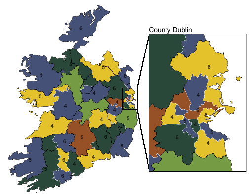

We have a new working paper out on redistricting simulation methods.
The paper presents a new Sequential Monte Carlo based algorithm (gSMC), one of the main computational tools used to generate and study redistricting plans.
gSMC extends the Sequential Monte Carlo approach of McCartan and Imai to a broader class of redistricting problems.
The goal is to make simulation-based redistricting analysis more flexible and more scalable across a wider range of institutional settings.

The new framework broadens where these analyses can be used.
It makes it possible to study systems with multi-member districts, allows researchers to work across different sampling setups, and supports large-scale applications that would otherwise be difficult to analyze.
More broadly, the paper expands the set of redistricting institutions and electoral systems that can be studied using simulation.

We illustrate the approach with two applications: elections to the Irish Parliament, which uses multi-member districts, and the Pennsylvania House of Representatives, which has more than 200 single-member districts.
Together, these examples show how the method can be used in very different redistricting settings.

{fig-alt="A map of Ireland with simulated districts and an inset for Dublin."}

If you’re interested in reading the paper, [check it out on arXiv](https://arxiv.org/abs/2603.22188).
The full abstract is below:

> Simulation methods have become important tools for quantifying partisan and racial bias in redistricting plans. We generalize the Sequential Monte Carlo (SMC) algorithm of McCartan and Imai (2023), one of the commonly used approaches. First, our generalized SMC (gSMC) algorithm can split off regions of arbitrary size, rather than a single district as in the original SMC framework, enabling the sampling of multi-member districts. Second, the gSMC algorithm can operate over various sampling spaces, providing additional computational flexibility. Third, we derive optimal-variance incremental weights and show how to compute them efficiently for each sampling space. Finally, we incorporate Markov chain Monte Carlo (MCMC) steps, creating a hybrid gSMC-MCMC algorithm that can be used for large-scale redistricting applications. We demonstrate the effectiveness of the proposed methodology through analyses of the Irish Parliament, which uses multi-member districts, and the Pennsylvania House of Representatives, which has more than 200 single-member districts.
